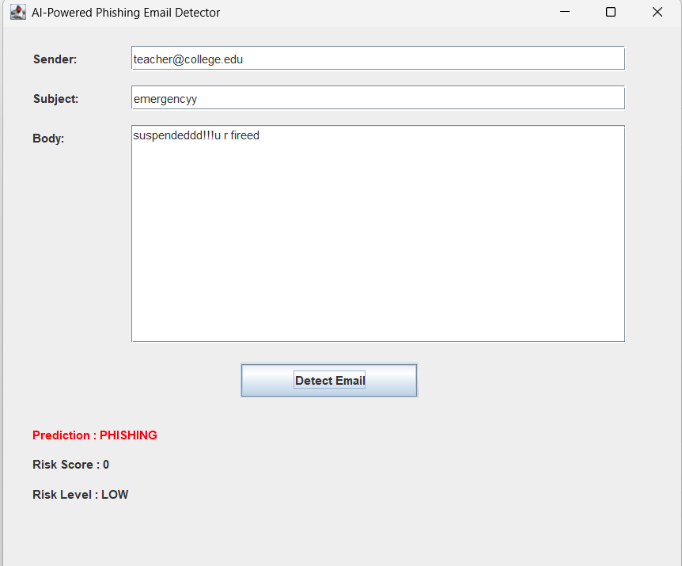
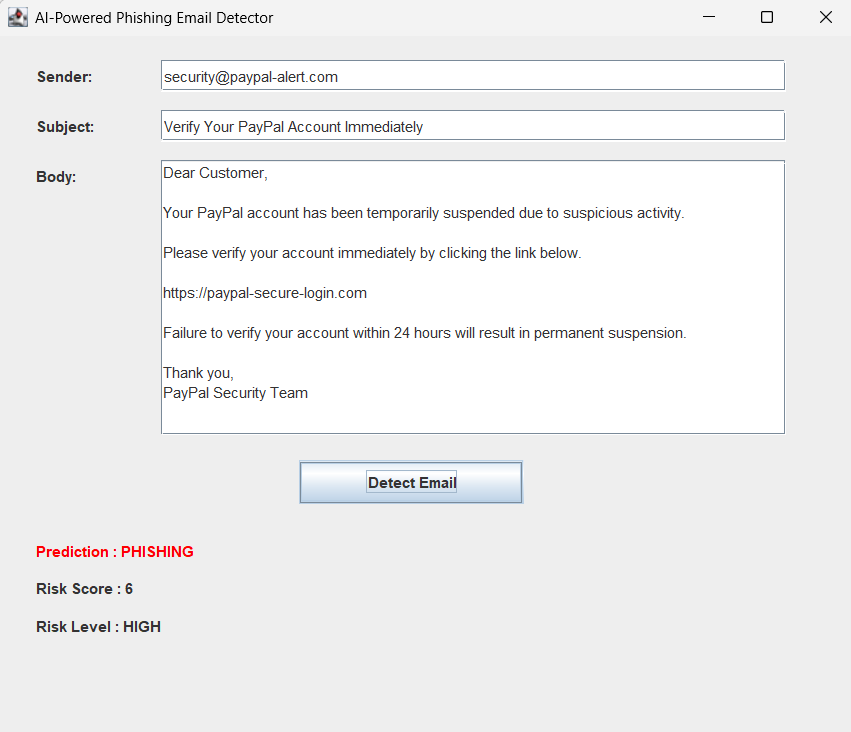
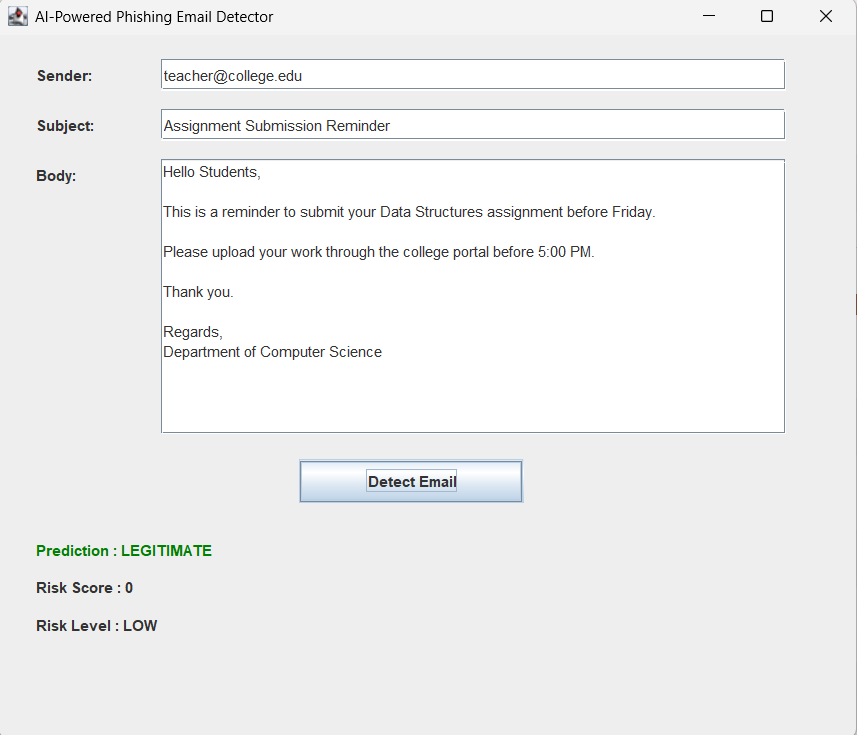

# AI-Powered Phishing Email Detector

## Overview

The AI-Powered Phishing Email Detector is a Java-based desktop application that detects whether an email is **Phishing** or **Legitimate** using the **Naive Bayes Machine Learning Algorithm**. The project also analyzes the risk level of an email based on suspicious characteristics such as URLs, keywords, and sender information.

The application provides an easy-to-use graphical interface where users can enter email details and instantly receive a prediction along with a risk score.

---

## Features

- Detects phishing and legitimate emails
- Uses the Naive Bayes classification algorithm
- Performs feature extraction from email content
- Calculates Risk Score
- Displays Risk Level (Low, Medium, High)
- Desktop GUI built using Java Swing
- Reads and trains using a CSV dataset
- Calculates Accuracy, Precision, Recall and F1-Score

---

## Technologies Used

- Java
- Java Swing
- Maven
- OpenCSV
- Git & GitHub

---

## Machine Learning Algorithm

This project uses the **Naive Bayes Classifier**.

The classifier is trained using a labeled phishing email dataset and predicts whether a new email is phishing or legitimate based on the probability of the words appearing in the email.

---

## Feature Extraction

The system extracts the following features from every email:

- URL Detection
- URL Count
- Free Email Detection
- Subject Length
- Body Length
- Suspicious Keyword Count

---

## Risk Analysis

The application assigns a risk score based on extracted features.

| Score | Risk Level |
|--------|------------|
| 0–2 | Low |
| 3–5 | Medium |
| 6+ | High |

---

## Dataset

The project uses a phishing email dataset stored in:

```
src/main/resources/emails.csv
```

Dataset Columns:

- Sender
- Receiver
- Date
- Subject
- Body
- Label
- URLs

---

## Performance

The trained model achieved approximately:

- Accuracy: **94.78%**
- Precision: **99.93%**
- Recall: **90.71%**
- F1 Score: **95.10%**

---

## Project Structure

```
src
│
├── main
│   ├── java
│   │   └── com.phishingdetector
│   │       ├── Main.java
│   │       ├── DetectorGUI.java
│   │       ├── Email.java
│   │       ├── EmailCSVReader.java
│   │       ├── FeatureExtractor.java
│   │       ├── RiskAnalyzer.java
│   │       ├── NaiveBayesClassifier.java
│   │       ├── DatasetGenerator.java
│   │       ├── PhishingDetector.java
│   │       └── StopWords.java
│   │
│   └── resources
│       └── emails.csv
```

---

## How to Run

### Clone the Repository

```bash
git clone <your-github-repository-link>
```

### Open the Project

Open the project using:

- VS Code
- IntelliJ IDEA
- Eclipse

### Compile

```bash
mvn compile
```

### Run Console Version

```bash
mvn exec:java
```

### Run GUI Version

Run:

```
DetectorGUI.java
```

---

## GUI Preview

### Home Screen



---

### Phishing Email Detection



---

### Legitimate Email Detection



The application allows the user to:

- Enter Sender
- Enter Subject
- Enter Email Body
- Click Detect Email

The system displays:

- Prediction
- Risk Score
- Risk Level

---

## Future Enhancements

- Deep Learning-based detection
- URL reputation checking
- Attachment scanning
- Real-time email monitoring
- Browser extension
- Cloud deployment
- Support for multiple machine learning algorithms

---

## Author

**Thanujareddy Kovvuri**

B.Tech – Computer Science and Engineering (Cyber Security)

Shri Vishnu Engineering College for Women

---

## License

This project is developed for educational purposes.